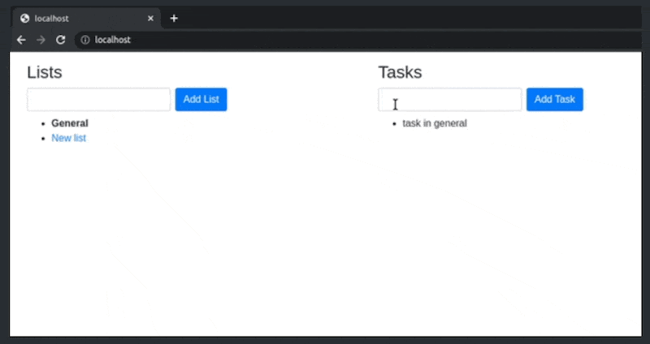

This project implements basic to-do list functionality that allows the user to create task lists and tasks in them.

#### Demo



The General task list is created by default.

The initial HTML after the app has been launched looks like this.

```html
<div class="row">
  <div class="col">
    <h3>Lists</h3>
    <form class="form-inline mb-2" data-container="new-list-form">
      <label for="new-list-name" class="sr-only">New list name</label>
      <input
        type="text"
        id="new-list-name"
        class="form-control mr-2"
        name="name"
        required
      />
      <input type="submit" class="btn btn-primary" value="Add List" />
    </form>
    <div data-container="lists">
      <ul>
        <li><b>General</b></li>
      </ul>
    </div>
  </div>
  <div class="col">
    <h3>Tasks</h3>
    <form class="form-inline mb-2" data-container="new-task-form">
      <label for="new-task-name" class="sr-only">New task name</label>
      <input
        type="text"
        id="new-task-name"
        class="form-control mr-2"
        name="name"
        required
      />
      <input type="submit" class="btn btn-primary" value="Add Task" />
    </form>
    <div data-container="tasks"></div>
  </div>
</div>
```

The HTML with a task added to the General task list looks like this

```html
<div class="row">
  <div class="col">
    <h3>Lists</h3>
    <form class="form-inline mb-2" data-container="new-list-form">
      <label for="new-list-name" class="sr-only">New list name</label>
      <input
        type="text"
        id="new-list-name"
        class="form-control mr-2"
        name="name"
        required
      />
      <input type="submit" class="btn btn-primary" value="Add List" />
    </form>
    <div data-container="lists">
      <ul>
        <li><b>General</b></li>
      </ul>
    </div>
  </div>
  <div class="col">
    <h3>Tasks</h3>
    <form class="form-inline mb-2" data-container="new-task-form">
      <label for="new-task-name" class="sr-only">New task name</label>
      <input
        type="text"
        id="new-task-name"
        class="form-control mr-2"
        name="name"
        required
      />
      <input type="submit" class="btn btn-primary" value="Add Task" />
    </form>
    <div data-container="tasks">
      <ul>
        <li>My First Task</li>
      </ul>
    </div>
  </div>
</div>
```

The HTML after adding a new task list but before switching to it looks like this

```html
<div class="row">
  <div class="col">
    <h3>Lists</h3>
    <form class="form-inline mb-2" data-container="new-list-form">
      <label for="new-list-name" class="sr-only">New list name</label>
      <input
        type="text"
        id="new-list-name"
        class="form-control mr-2"
        name="name"
        required
      />
      <input type="submit" class="btn btn-primary" value="Add List" />
    </form>
    <div data-container="lists">
      <ul>
        <li><b>General</b></li>
        <li><a href="#random">Random</a></li>
      </ul>
    </div>
  </div>
  <div class="col">
    <h3>Tasks</h3>
    <form class="form-inline mb-2" data-container="new-task-form">
      <label for="new-task-name" class="sr-only">New task name</label>
      <input
        type="text"
        id="new-task-name"
        class="form-control mr-2"
        name="name"
        required
      />
      <input type="submit" class="btn btn-primary" value="Add Task" />
    </form>
    <div data-container="tasks">
      <ul>
        <li>My First Task</li>
      </ul>
    </div>
  </div>
</div>
```

The HTML after switching to the new Random task list looks like this

```html
<div class="row">
  <div class="col">
    <h3>Lists</h3>
    <form class="form-inline mb-2" data-container="new-list-form">
      <label for="new-list-name" class="sr-only">New list name</label>
      <input
        type="text"
        id="new-list-name"
        class="form-control mr-2"
        name="name"
        required
      />
      <input type="submit" class="btn btn-primary" value="Add List" />
    </form>
    <div data-container="lists">
      <ul>
        <li><a href="#general">General</a></li>
        <li><b>Random</b></li>
      </ul>
    </div>
  </div>
  <div class="col">
    <h3>Tasks</h3>
    <form class="form-inline mb-2" data-container="new-task-form">
      <label for="new-task-name" class="sr-only">New task name</label>
      <input
        type="text"
        id="new-task-name"
        class="form-control mr-2"
        name="name"
        required
      />
      <input type="submit" class="btn btn-primary" value="Add Task" />
    </form>
    <div data-container="tasks"></div>
  </div>
</div>
```

Lists have unique names. Adding a list with an existing name does nothing.